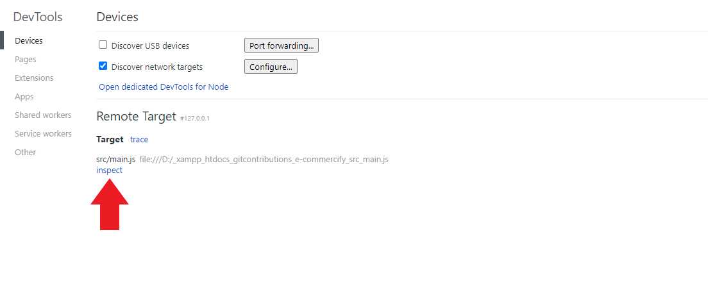

# Using Chrome Dev Tools To Debug The Backend

You can use Chrome Dev Tools to debug the backend as it comes pre-configured with this project. Follow the rules given below to do so -

1. Run the server by entering `npm run debug`
2. Open `Google Chrome` on your PC
3. Go to `chrome://inspect/#devices`
4. Click on **inspect**

   

5. You can now use the console to debug the server just like in the frontend!

   
