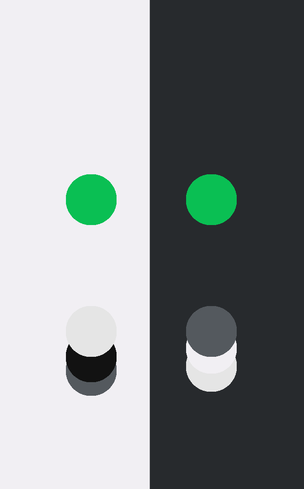
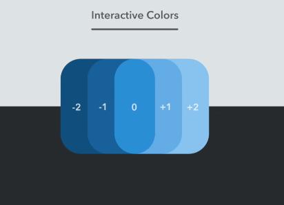

# Design/Style Guide For E-Commercify

We'll go over the design decision and selected colors in this doc.

**All the color will be declared as CSS variables in the `main.css` file. Do NOT use colors without declaring them as CSS variables in the `main.css` file!**

_Please note that: All the sites will have a `Light Mode` and `Dark Mode`. When in development we will develop the dark mode first then we will use [color changing techniques](https://medium.com/@mwichary/dark-theme-in-a-day-3518dde2955a) to invert our colors into lighter versions of them._

## Brand Color and Logo

For this project, we will use `#0abf53` as the brand color.

The brand logo will have this placeholder logo -

## Background Colors

The light background will have the color `#f1eff3` and the dark background will have the color `#272a2d`.

## State Expressive Colors

Every design needs to represent some common application state with colors.

The **Success** state will have the color `#2c9f45`.

The **Warning** state will have the color `#f9a825`.

The **Error** state will have the color `#d53e3e`.

The **Active** state will have the color `#2a8ed5`.

The **Disabled** state will have the color `#D3D3D3`.

## Color Flexibility

You can use _lighter_ or _darker_ version of any color if necessary. Just remember to declare them as CSS variables in the `main.css` file.

## Font and Typography

All of the text in the project should meet the `AA Contrast Standard`. The colors can be changed as needed to achieve the `AA Contrast Standard`. (You can check color contrast with Chrome Dev Tools)

For the font, we'll be using [`Nunito`](https://fonts.google.com/specimen/Nunito).
