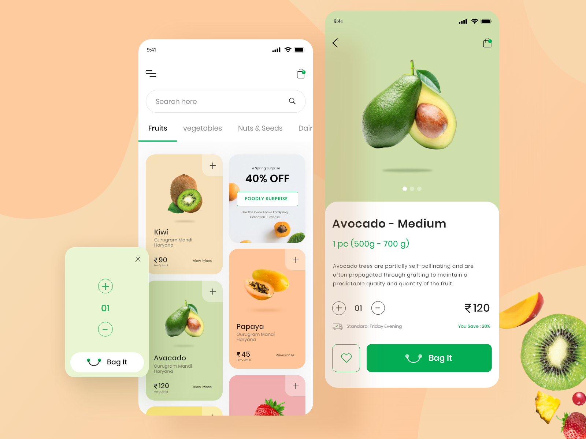
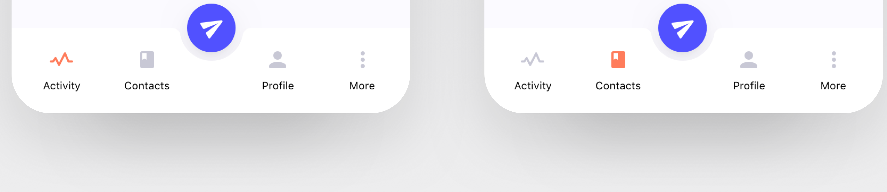

# User Visited Site Design

This will be the user facing site, where customers will go. The website will be created by following the [Design Style Guide](DESIGN_GUIDE.md).

The site will have 5 main pages (this pages will be accessible from the navbar) -

1. Homepage

This will be the layout of the homepage -

2. Catagories
3. Search
4. Cart
5. Account

There will also be some additional pages for -

- Each of the banners
- Any special offer etc

Each page will **ALWAYS** have the navbar on the bottom of the page. The navbar will have a similar layout like this -

